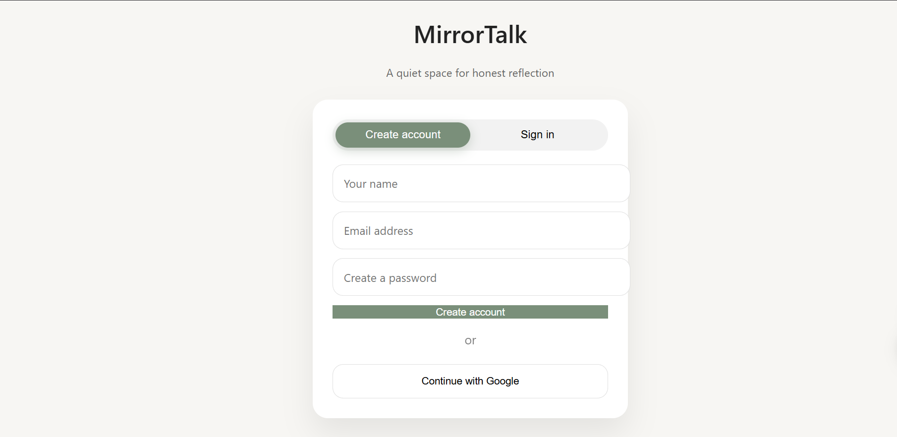
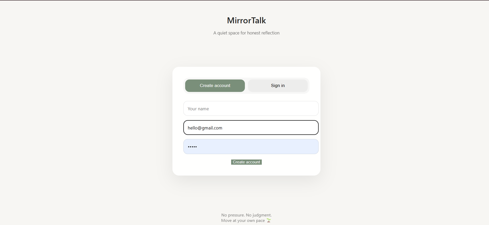
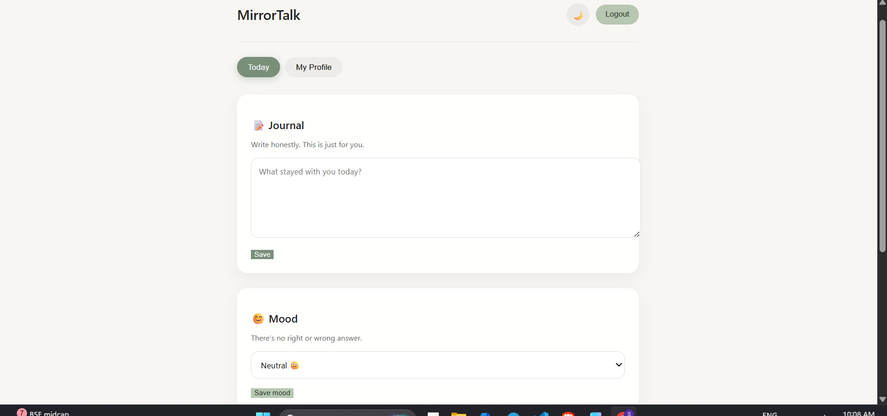
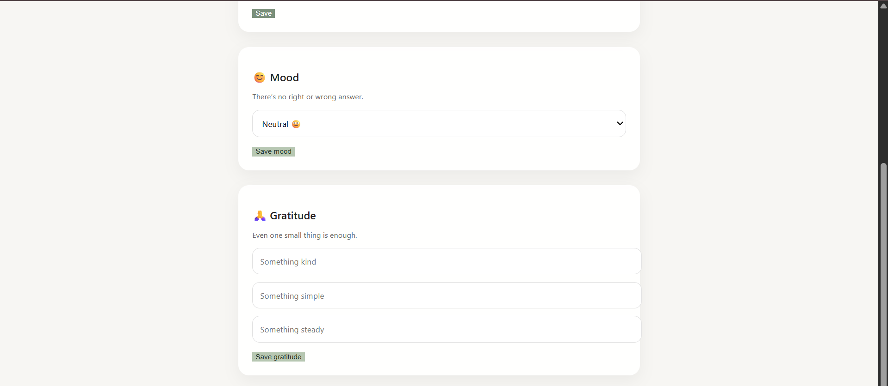
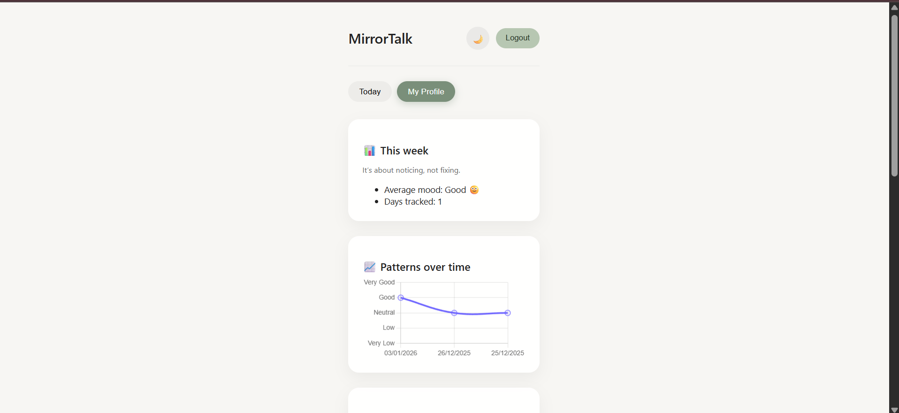

# MirrorTalk 🌱

A calm, private space for daily reflection and emotional awareness.

MirrorTalk is a full-stack journaling and mood-tracking web application built for students who want a safe, distraction-free way to reflect on their thoughts and emotions. Users can log journal entries, track mood patterns, write gratitude notes, and view weekly emotional insights — all in a minimal, judgment-free interface.

---

## Features

- JWT-based secure authentication with protected routes
- Daily private journal entries with CRUD operations
- Mood tracking on a 1–5 scale with weekly summaries
- Gratitude journaling
- Mood trend visualization over time
- Light / Dark mode
- Session persistence

---

## Tech Stack

| Layer | Technologies |
|---|---|
| Frontend | React, React Router, Custom CSS |
| Backend | Node.js, Express.js |
| Database | MySQL |
| Auth | JSON Web Tokens (JWT) |

---

## Project Structure

```
MirrorTalk/
├── backend/
│   ├── routes/
│   ├── controllers/
│   ├── middleware/
│   ├── db/
│   │   └── schema.sql
│   └── index.js
├── frontend/
│   ├── src/
│   │   ├── components/
│   │   ├── pages/
│   │   └── App.jsx
│   └── package.json
└── README.md
```

---

## Getting Started

### Prerequisites

- Node.js v18+
- MySQL 8+
- npm

### 1. Clone the repository

```bash
git clone https://github.com/shivangi-guptaa/MirrorTalk.git
cd MirrorTalk
```

### 2. Set up the database

Open MySQL and run the schema file:

```bash
mysql -u root -p < backend/db/schema.sql
```

This creates the `mirrortalk` database and all required tables.

### 3. Configure environment variables

Create a `.env` file inside the `backend/` folder:

```bash
cp backend/.env.example backend/.env
```

Fill in your values:

```env
DB_HOST=localhost
DB_USER=root
DB_PASSWORD=your_password
DB_NAME=mirrortalk
JWT_SECRET=your_jwt_secret_key
PORT=5000
```

### 4. Install dependencies and run

**Terminal 1 — Backend:**

```bash
cd backend
npm install
npm start
```

**Terminal 2 — Frontend:**

```bash
cd frontend
npm install
npm start
```

The app will be available at `http://localhost:3000`.

---

## API Overview

| Method | Endpoint | Description |
|---|---|---|
| POST | `/api/auth/register` | Register a new user |
| POST | `/api/auth/login` | Login and receive JWT |
| GET | `/api/journals` | Fetch all journal entries |
| POST | `/api/journals` | Create a new journal entry |
| PUT | `/api/journals/:id` | Update a journal entry |
| DELETE | `/api/journals/:id` | Delete a journal entry |
| GET | `/api/mood` | Fetch mood history |
| POST | `/api/mood` | Log a mood entry |
| GET | `/api/mood/summary` | Weekly mood summary |

---

## Screenshots

**Home Page**


**Sign Up / Sign In**


**Dashboard — Daily Reflection & Mood Tracking**



**Profile — History & Insights**


---

## Environment Variables Reference

| Variable | Description |
|---|---|
| `DB_HOST` | MySQL host (usually `localhost`) |
| `DB_USER` | MySQL username |
| `DB_PASSWORD` | MySQL password |
| `DB_NAME` | Database name (`mirrortalk`) |
| `JWT_SECRET` | Secret key for signing JWTs |
| `PORT` | Port for the backend server |

---

## Design Philosophy

MirrorTalk prioritizes calm over clutter.

- Soft colors to reduce cognitive load
- Card-based layout for clarity
- Minimal UI to encourage honest reflection
- No streaks, no gamification — just space to think

---

## Roadmap

- [ ] Emotion trend charts
- [ ] Export journal data as PDF
- [ ] ARIA accessibility enhancements
- [ ] Deployment on Render

---

## Author

Built by **Shivangi Gupta**
MCA Student, NIT Bhopal
[LinkedIn](http://www.linkedin.com/in/shivangi-gupta-nitbhopal) · [GitHub](https://github.com/shivangi-guptaa)
