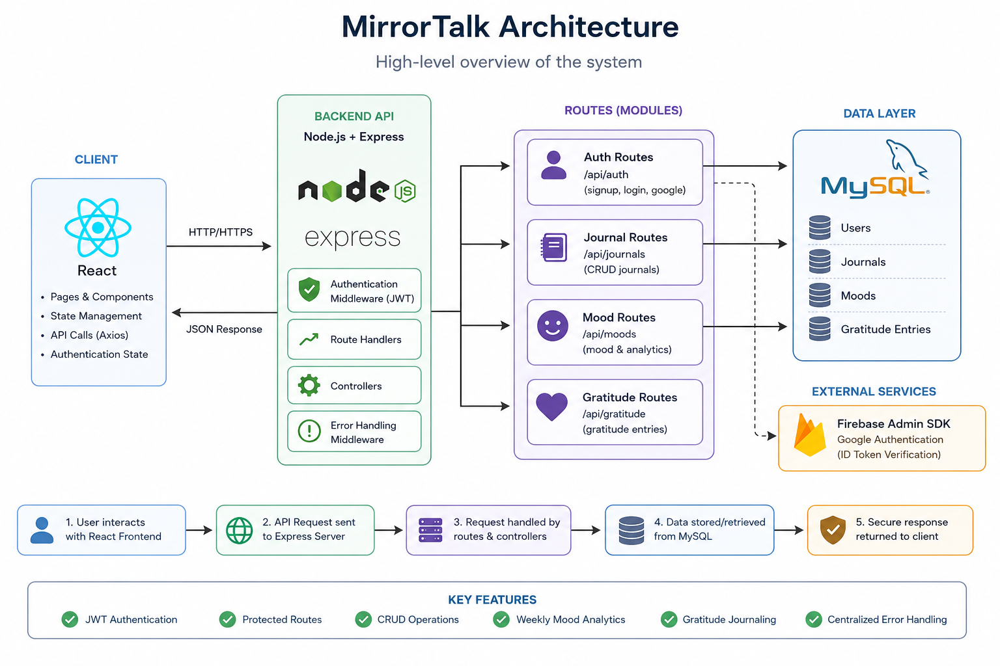

# MirrorTalk 🌱

A calm, private space for daily reflection and emotional awareness.

MirrorTalk is a full-stack journaling and mood-tracking web application built for students who want a safe, distraction-free way to reflect on their thoughts and emotions. Users can maintain private journal entries, track mood patterns, record gratitude moments, and gain emotional insights through weekly mood analytics.

---

##Architecture diagram 



## Features

* JWT-based authentication with protected routes
* Google Sign-In authentication using Firebase
* Private journaling with full CRUD functionality
* Daily mood tracking on a 1–5 scale
* Weekly mood analytics and emotional insights
* Gratitude journaling with editable daily entries
* Mood history tracking
* Centralized error handling
* Session persistence
* Responsive UI with Light and Dark mode

---

## Tech Stack

| Layer          | Technologies                           |
| -------------- | -------------------------------------- |
| Frontend       | React, React Router, Custom CSS        |
| Backend        | Node.js, Express.js                    |
| Database       | MySQL                                  |
| Authentication | JWT, Firebase Authentication           |
| Security       | bcrypt.js, Protected Routes Middleware |

---

## Project Structure

```text
MirrorTalk/
├── backend/
│   ├── routes/
│   │   ├── authRoutes.js
│   │   ├── journalRoutes.js
│   │   ├── moodRoutes.js
│   │   └── gratitudeRoutes.js
│   ├── middleware/
│   │   ├── authMiddleware.js
│   │   └── errorMiddleware.js
│   ├── config/
│   │   ├── db.js
│   │   └── firebaseAdmin.js
│   ├── sql_schema.txt
│   └── server.js
│
├── frontend/
│   ├── src/
│   │   ├── components/
│   │   ├── pages/
│   │   └── App.jsx
│   └── package.json
│
└── README.md
```

---

## Getting Started

### Prerequisites

* Node.js v18+
* MySQL 8+
* npm

### 1. Clone the repository

```bash
git clone https://github.com/shivangi-guptaa/MirrorTalk.git
cd MirrorTalk
```

### 2. Set up the database

Create a MySQL database:

```sql
CREATE DATABASE mirrortalk;
USE mirrortalk;
```

Run the schema file:

```bash
mysql -u root -p < backend/sql_schema.txt
```

### 3. Configure Environment Variables

Create a `.env` file inside the backend folder:

```env
DB_HOST=localhost
DB_USER=root
DB_PASSWORD=your_password
DB_NAME=mirrortalk

JWT_SECRET=your_jwt_secret_key

PORT=5000
```

For Google Authentication, add your Firebase Admin SDK credentials file:

```text
backend/firebaseServiceAccount.json
```

### 4. Install Dependencies

Backend:

```bash
cd backend
npm install
```

Frontend:

```bash
cd frontend
npm install
```

### 5. Run the Application

Backend:

```bash
npm start
```

Frontend:

```bash
npm start
```

Frontend:

```text
http://localhost:3000
```

Backend:

```text
http://localhost:5000
```

---

## REST API Overview

### Authentication

| Method | Endpoint           | Description                       |
| ------ | ------------------ | --------------------------------- |
| POST   | `/api/auth/signup` | Register a new user               |
| POST   | `/api/auth/login`  | Login and receive JWT token       |
| POST   | `/api/auth/google` | Authenticate using Google Sign-In |

### Journals

| Method | Endpoint            | Description               |
| ------ | ------------------- | ------------------------- |
| GET    | `/api/journals`     | Fetch all journal entries |
| POST   | `/api/journals`     | Create a journal entry    |
| PUT    | `/api/journals/:id` | Update a journal entry    |
| DELETE | `/api/journals/:id` | Delete a journal entry    |

### Mood Tracking

| Method | Endpoint                    | Description                |
| ------ | --------------------------- | -------------------------- |
| GET    | `/api/moods`                | Retrieve mood history      |
| POST   | `/api/moods`                | Add or update today's mood |
| GET    | `/api/moods/weekly-summary` | Weekly mood analytics      |

### Gratitude Journal

| Method | Endpoint         | Description                        |
| ------ | ---------------- | ---------------------------------- |
| GET    | `/api/gratitude` | Fetch gratitude history            |
| POST   | `/api/gratitude` | Create or update gratitude entries |

### System

| Method | Endpoint      | Description          |
| ------ | ------------- | -------------------- |
| GET    | `/api/health` | Backend health check |

---

## Backend Highlights

* 12 REST API endpoints
* JWT authentication and authorization
* Google Authentication via Firebase Admin SDK
* MySQL relational database design
* Middleware-based route protection
* Daily mood tracking with automatic updates
* Weekly mood analytics endpoint
* Gratitude journaling with UPSERT support
* Centralized error handling
* Secure password hashing using bcrypt

---

## Database Schema

### Users

Stores user account information.

### Journals

Stores private journal entries linked to users.

### Moods

Stores daily mood ratings and supports mood analytics.

### Gratitude Entries

Stores daily gratitude reflections with editable entries.

---

## Screenshots

### Home Page


### Sign Up / Sign In


### Dashboard


### Profile


---

## Environment Variables

| Variable    | Description                    |
| ----------- | ------------------------------ |
| DB_HOST     | MySQL host                     |
| DB_USER     | MySQL username                 |
| DB_PASSWORD | MySQL password                 |
| DB_NAME     | Database name                  |
| JWT_SECRET  | Secret used to sign JWT tokens |
| PORT        | Backend server port            |

---

## Design Philosophy

MirrorTalk prioritizes reflection over engagement metrics.

* Clean and distraction-free interface
* Minimal visual clutter
* Focus on emotional awareness
* Private and secure user experience
* Encourages consistent self-reflection without gamification

---

## Future Improvements

* Export journals as PDF
* Monthly mood analytics dashboard
* Search and filter journal entries
* Email-based password reset
* Improved accessibility support
* Docker deployment
* Cloud deployment on Render

---

## Author

Built by **Shivangi Gupta**
MCA Student, NIT Bhopal
[LinkedIn](http://www.linkedin.com/in/shivangi-gupta-nitbhopal) · [GitHub](https://github.com/shivangi-guptaa)
l
