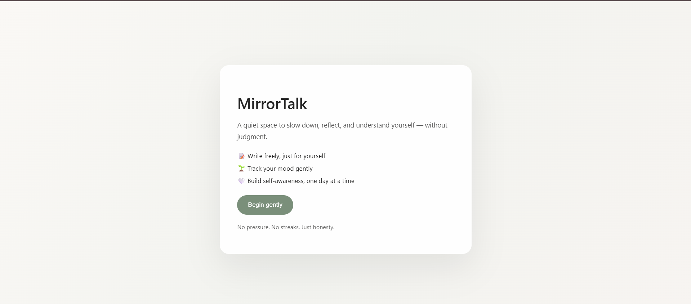
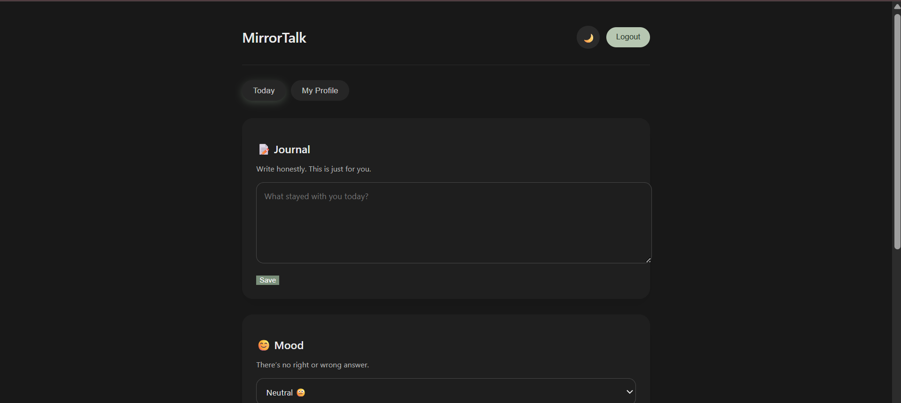
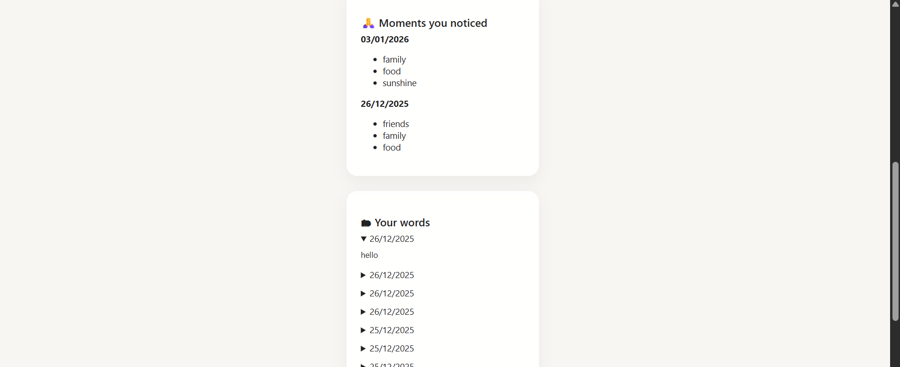

# MirrorTalk 🌱  
A calm, private space for daily reflection and emotional awareness.

MirrorTalk is a minimal journaling and mood-tracking web application designed for
students who want a safe, distraction-free way to reflect on their thoughts and
emotions.

---

## 🧠 Why MirrorTalk?

Most journaling apps focus on productivity and streaks.
MirrorTalk focuses on **emotional safety**.

The interface is intentionally calm, minimal, and judgment-free —
encouraging honest reflection without pressure.

---

## 🚀 Features

- 🔐 Secure authentication (JWT-based)
- 📝 Daily private journal entries
- 😊 Mood tracking (1–5 scale)
- 📊 Weekly emotional insights
- 🙏 Gratitude journaling
- 🌙 Light / Dark mode
- 🔒 Protected routes & session persistence

---

## 🛠 Tech Stack

**Frontend**
- React
- React Router
- Custom CSS (no UI libraries)

**Backend**
- Node.js
- Express
- MySQL
- JWT Authentication

---

## 📸 Screenshots

> Home Page:

> Sign up/Sign in page

> Dashboard – Daily Reflection & Mood Tracking

> My profile - to track history

## 💡 Design Philosophy

MirrorTalk prioritizes calm over clutter.

- Soft colors to reduce cognitive load  
- Card-based layout for clarity  
- Gentle micro-animations  
- Minimal UI to encourage reflection  

---

## 🔮 Future Improvements

- Emotion trend charts
- Export journal data
- Accessibility enhancements (ARIA)
- Modular CSS architecture

---

## 👤 Author

Built with intention by **Shivangi**  
_MCA Student | Aspiring Software Engineer_
